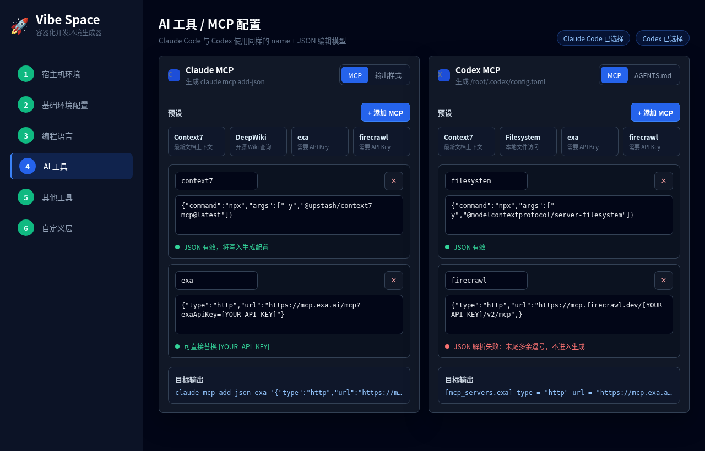

# MCP 与 Skills 导入体验设计

## 背景

当前 MCP / Skills 功能区存在两个主要问题：

- Codex MCP 使用市场条目卡片选择，无法像 Claude MCP 那样编辑 `name + JSON`，导致 exa、firecrawl 等需要 API Key 的配置无法填写。
- Skills 被设计成类似市场条目的 JSON 数据，包含 `id`、`name`、`sourceUrl`、`installMode` 等字段，但实际自定义 Skill 应是一个包含 `SKILL.md` 的文件夹。

## 目标

- MCP 使用可编辑的 `name + JSON` 配置模型。
- Skills 使用文件夹导入模型。
- Claude Code 也支持导入 Skills。
- 不再把 Skills 当作 JSON 条目、URL 或安装 TODO 生成。
- 保持项目无构建链、纯静态页面和 Alpine.js 状态管理模式。

## 非目标

- 不实现远程 Skill 市场自动安装。
- 不解析或改写 `SKILL.md` 内容。
- 不把 GitHub URL 当作已安装 Skill。
- 不上传、不保存用户导入的 Skill 文件到远端。

## 术语

- MCP 配置：一个名称和一段 JSON 配置。JSON 可以是 stdio 形态，也可以是 HTTP 形态。
- Skill 文件夹：一个包含 `SKILL.md` 的目录，可以带有脚本、模板、参考文档和其他支持文件。
- Skill 安装：把 Skill 文件夹原样还原到目标 AI 工具识别的 Skills 目录。

## MCP 设计

MCP 应按配置 JSON 管理，不按市场条目卡片管理。

UI 行为：

- Claude Code 与 Codex 使用同一套交互模型：预设快捷按钮、`+ 添加 MCP`、可编辑配置行。
- 提供预设快捷按钮，复用当前 `DEFAULTS.mcpPresets` 中的 MCP preset 数据。
- 提供 `+ 添加 MCP`。
- 每条 MCP 都包含：
  - 名称输入框。
  - JSON 输入框。
  - 删除按钮。
  - JSON 校验状态。
- 点击 exa、firecrawl 等预设后，生成可编辑行，用户可以直接替换 API Key。

JSON 示例：

```json
{"command":"npx","args":["-y","@upstash/context7-mcp@latest"]}
```

```json
{"type":"http","url":"https://mcp.exa.ai/mcp?exaApiKey=[YOUR_API_KEY]"}
```

```json
{"type":"http","url":"https://mcp.firecrawl.dev/[YOUR_API_KEY]/v2/mcp"}
```

生成规则：

- JSON 合法且名称非空时进入生成配置。
- JSON 非法时 UI 显示错误，且不进入生成配置。
- Claude Code 继续使用现有 `claude mcp add-json` 生成逻辑。
- Codex MCP 继续生成 `/root/.codex/config.toml`。

## Skills 设计

Skills 应按文件夹管理，不按 JSON 条目管理。

UI 行为：

- 提供 `导入 Skill 文件夹`。
- 展示已导入 Skill 文件夹列表。
- 每个已导入项只展示文件夹名、文件数量和校验状态。
- 提供删除按钮。
- 不提供 `id`、`name`、`description`、`sourceUrl`、`installMode` 等手填表单。
- 不提供 Skill JSON 条目导入作为主路径。

导入规则：

- 如果选择的目录根部包含 `SKILL.md`，视为导入一个 Skill。
- 如果选择的是父目录，且其一级子目录中有多个目录包含 `SKILL.md`，视为批量导入多个 Skill。
- 没有 `SKILL.md` 的目录不导入，并显示错误。
- Skill 目录名就是安装目录名。
- `SKILL.md` 只用于校验存在，不解析、不改写。

文件处理：

- 记录每个文件的相对路径和内容。
- 保留子目录结构。
- 统一使用 base64 在 Dockerfile 中还原文件，避免文本转义和二进制文件损坏。
- 拒绝绝对路径、空路径和包含 `..` 的路径。

## 目录约定

### Claude Code 目录约定

- 写入 `/root/.claude/skills/<skill-folder>/`

### Codex 目录约定

- 写入 `/root/.codex/skills/<skill-folder>/`

### 通用约定

导入前，每个 Skill 文件夹根部必须包含：

```text
<skill-folder>/SKILL.md
```

同一份导入列表按已选择的 AI 工具分发：

- 只选 Claude Code 时，仅写入 `/root/.claude/skills/<skill-folder>/`。
- 只选 Codex 时，仅写入 `/root/.codex/skills/<skill-folder>/`。
- 同时选择 Claude Code 与 Codex 时，同一份 Skill 文件夹同时还原到两个目录。
- 安装后，目标目录中应存在 `/root/.claude/skills/<skill-folder>/SKILL.md` 或 `/root/.codex/skills/<skill-folder>/SKILL.md`。


## UI 交互

AI 工具页中的 MCP / Skills 区应按工具能力显示：

- 选择 Claude Code 时：
  - 显示 Claude MCP 配置。
  - 显示 Claude 输出样式配置。
- 选择 Codex 时：
  - 显示 Codex MCP 配置。
  - 显示 Codex `AGENTS.md` 输出样式配置。
- 选择 Claude Code 或 Codex 任一工具时：
  - 显示共享的 Skills 文件夹导入卡片。
  - Skills 卡片展示目标安装目录摘要，并随工具选择动态变化。

MCP 和 Skills 不应共用同一种“条目 JSON 导入”交互。

主 UI 不再展示：

- MCP / Skills 市场源管理。
- 手动导入条目。
- 可选条目。
- 已选条目。
- Skill 的 JSON 条目导入。

如后续补充外部 MCP preset 数据源，也只能服务于 MCP 预设补充，不应驱动 Skills 条目选择。

## UI 原型图

原型图仅作为视觉参考，交互与生成规则以本文档文字规格为准。视觉风格沿用当前页面截图的深色主题、灰色卡片、细边框、蓝色强调和紧凑表单。

- MCP 可编辑配置原型：
- Skills 文件夹导入原型：

MCP 原型应表达：

- Claude / Codex tab 或工具分区。
- 预设快捷按钮。
- 有效 JSON 行。
- exa API Key 占位符直接出现在可编辑 JSON 输入框中。
- JSON 错误态。

Skills 原型应表达：

- `导入 Skill 文件夹` 按钮。
- 已导入文件夹列表。
- 目标目录摘要。
- 无 `SKILL.md` 错误态。
- 不出现市场条目、URL 安装、Skill JSON 条目或手填 `id/name/description/sourceUrl/installMode`。

## 状态与数据模型

MCP 状态可以使用配置对象数组：

```js
[{ name: 'exa', json: '{"type":"http","url":"..."}', jsonValid: true }]
```

Skills 状态应表示文件夹资产，而不是业务条目：

```js
[
  {
    folderName: 'my-skill',
    valid: true,
    files: [
      { path: 'SKILL.md', base64: '...' },
      { path: 'scripts/run.sh', base64: '...' }
    ]
  }
]
```

该结构只用于浏览器运行时和 Dockerfile 生成，不暴露给用户填写。

## Dockerfile 生成策略

MCP：

- Claude Code 使用 `claude mcp add-json`。
- Codex 使用 `/root/.codex/config.toml`。

Skills：

- Claude Code 写入 `/root/.claude/skills/<skill-folder>/`。
- Codex 写入 `/root/.codex/skills/<skill-folder>/`。
- 保留原相对路径。
- 用 base64 还原每个文件。
- 未导入 Skills 时不生成空 Skills 目录。
- 未选择对应 AI 工具时不生成对应 Skills 目录。

## 校验与错误处理

- MCP JSON 非法：标红提示，不进入生成。
- Skill 文件夹无 `SKILL.md`：显示错误，不覆盖已有导入。
- Skill 文件路径非法：跳过该文件并提示错误。
- 同名 Skill 再次导入：以后一次导入覆盖同名文件夹。
- 文件夹导入失败：保留现有配置，不清空列表。

## 验证清单

文档检查：

- MCP UI 明确为可编辑 `name + JSON`。
- exa 示例包含 `{"type":"http","url":"https://mcp.exa.ai/mcp?exaApiKey=[YOUR_API_KEY]"}`。
- Skills 明确为文件夹导入，且必须包含 `SKILL.md`。
- Claude / Codex Skills 目录分别写明为 `/root/.claude/skills/<skill-folder>/` 与 `/root/.codex/skills/<skill-folder>/`。
- 文档不再把 Skills 描述成 marketplace item、JSON entry、URL install 或 TODO 占位。

原型图检查：

- MCP 和 Skills 两类交互分开表达。
- 原型图不混用市场条目模型。
- 错误态、空态、已配置态能够指导后续实现。

后续实现验证：

- Codex MCP 预设 exa 可以编辑 API Key。
- 手动输入 HTTP MCP JSON 后可以生成正确配置。
- 手动输入 stdio MCP JSON 后可以生成正确配置。
- 非法 MCP JSON 不进入生成。
- Claude Code / Codex 可以导入包含 `SKILL.md` 的 Skill 文件夹。
- Claude Code / Codex 可以批量导入多个包含 `SKILL.md` 的一级子目录。
- 无 `SKILL.md` 的目录被拒绝。
- 导入的 Skill 子目录和文件内容在 Dockerfile 中保持原样。
- 未选择 Claude Code 时不生成 `/root/.claude/skills`。
- 未选择 Codex 时不生成 `/root/.codex/skills`。
- 未导入 Skills 时不生成空 Skills 目录。

## 参考链接

- Claude Code Skills: <https://code.claude.com/docs/en/skills>
- Claude Code Skills 中文文档: <https://code.claude.com/docs/zh-CN/skills>
- Codex MCP: <https://developers.openai.com/codex/mcp>
